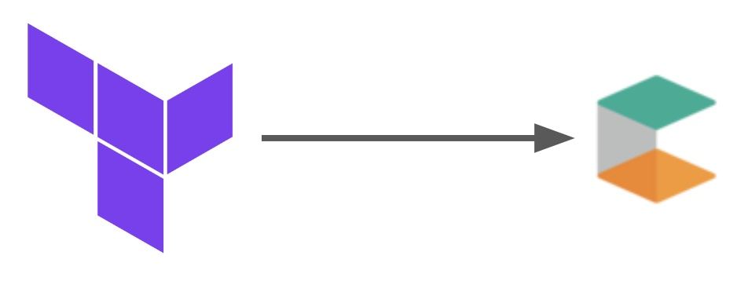

# commercetools demoprovisioner



This module uses a config file to create a standardized demo environment. For now only for EMEA based setups. The module is using the fantastic [Lab Digital commercetools provider](https://registry.terraform.io/providers/labd/commercetools/latest)

***Pre requisites:***
- a ```ct-config.yml``` file like [this](ct-config.yml) in the root
- a ```.env``` file in the root
- a ```main.tf``` in the root

the ```main.tf``` file should look like this

```javascript
module "demoprovisioner" {
   source  = "commercetools-demo/demoprovisioner/commercetools"
   version = "1.0.2"
}
```

***usage***
1. ```terraform init```
2. ```terraform plan``` to see the expected changes
3. ```terraform apply``` to apply the changes

***Expected output after the apply:***

## International

### Currencies


### Languages


### Countries


### Zones


## Taxes

## Shipping methods

## Channels

## Stores